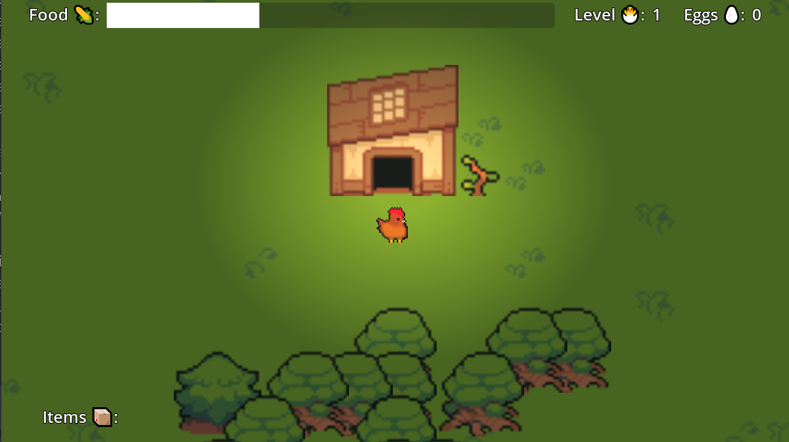

# 🐣 Chickeeen !!!

You are a chicken! You need to eat food, lay eggs and collect stuff.

  

## 🐔 Team

- 🎨 [Brian](https://github.com/lextum): Head of Pixelart
- 👾 [Jan](https://github.com/dev-jan): Head of AI
- 🤯 [Benj](https://github.com/randombenj): Head of Feature Creep
- 🎶 [Marco](https://github.com/eddex): Head of Sound Design

## 🐤 The Game

You can:

 - 🐤 You can walk around 
 - 🌽 You can search and eat food 
 - ⚠️ Be carefull the further you go, the more dangerous it gets.
 - 🐺At night, daemon wolfs will appear and kill you
 - 🥚 By eating food you can lay eggs, or level up.
 - 🐣 New levels will unlock new abilities ...
 - 💤 Sleep inside at night when you are scared
 - 🔫 Fight against your enemies with your shotgun

*Have fun you are not smart but you are happy.*

## 🍗 Assets used:

 - [Ninja Adventure Asset Pack by Pixel-Boy and AAA](https://pixel-boy.itch.io/ninja-adventure-asset-pack)
 - [Road to Paris (Gypsy Jazz) by ArtMusic](https://pixabay.com/de/music/volk-road-to-paris-gypsy-jazz-144631/)
 - [Guitar Mellow Beat 20221122 by genxbeats](https://pixabay.com/de/music/schlagt-guitar-mellow-beat-20221122-128596/)
 - [Scary Ambient Wind by Alexandr Zhelanov](https://opengameart.org/content/scary-ambient-wind)
